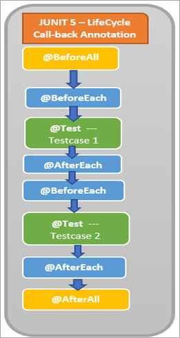

# JUnit 5 

## Whats new  
 

## JUnit 4 
The entire framework was contained in a `single JAR`.  
- The whole library needs to be imported even when only single feature required.
- One test runner can only execute tests at a time
- Never advanced beyond Java 7.
 
 

## JUnit 5
JUnit 5 is composed of three main modules (`Platform`, `Jupiter`, `Vintage`).  
- We get more granularity and can import only what is necessary.
- Allows multiple test runners to work simultaneously
- Makes good use of Java 8 features.

### `Platform`
Serves as a foundation for launching a testing framework on the JVM and defines the TestEngine API for developing a testing framework that runs on the platform.

### `Jupiter`
Includes the new programming model for writing tests and the extension model for writing extensions in JUnit 5

- @TestFactory – denotes a method that's a test factory for dynamic tests
- @DisplayName – defines a custom display name for a test class or a test method
- @Nested – denotes that the annotated class is a nested, non-static test class
- @Tag – declares tags for filtering tests
- @ExtendWith – registers custom extensions
- @BeforeEach – denotes that the annotated method will be executed before each test method - (previously @Before)
- @AfterEach – denotes that the annotated method will be executed after each test method (previously @After)
- @BeforeAll – denotes that the annotated method will be executed before all test methods in the current class (previously @BeforeClass)
- @AfterAll – denotes that the annotated method will be executed after all test methods in the current class (previously @AfterClass)
- @Disable – disables a test class or method (previously @Ignore)

### `Vintage`
Provides a TestEngine that allows backward compatibility with JUnit 4 or JUnit 3
Following is a list of frequently used Annotations in JUnit4

- @RunWith
- @Before
- @BeforeClass
- @After
- @AfterClass
- @Test
- @Ignore - not yet implemented 
- @Test(timeout=500)
- @Test(expected=IllegalArgumentException.class)

### JUnit 5 lifecycle annotations 
<table>
<tr>
<td>

</td>
<td>
- The method annotated with <b style="color:orange">@BeforeAll</b> is executed once at the start of the class.  
- The method annotated with <b style="color:orange">@BeforeEach</b> executes before Testcase 1 begins.  
- The method Testcase1 annotated with <b style="color:orange">@Test</b> is the testcase in the class.  
- The method annotated with <b style="color:orange">@AfterEach</b> runs after Testcase 1 completes execution.  
- The method annotated with <b style="color:orange">@BeforeEach</b> executes before Testcase 2 begins.  
- The method Testcase2 annotated with <b style="color:orange">@Test</b> is the testcase in the class.  
- The method annotated with <b style="color:orange">@AfterEach</b> runs after Testcase 2 completes execution.  
- The method annotated with <b style="color:orange">@AfterAll</b> is executed once at the end of the class after both testcase 1 and 2 are executed.
</td>
</tr>
</table>